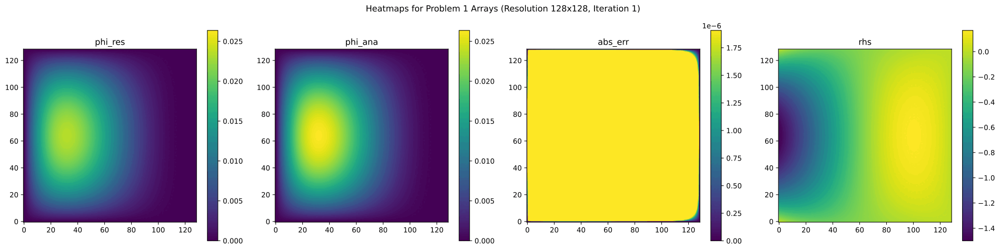

# JAX Multigrid Solver for 2D Diffusion

[](https://github.com/davef96/jsolver/actions/workflows/tests.yml)

Multigrid solver for steady-state diffusion problem of the following form:

```math
\nabla\cdot\left(D\nabla\phi\right) - \lambda\phi = rhs
```

- `D`: diffusion tensor
- `phi`: unknown density function
- `lambda`: decay rate
- `rhs`: source density

The solver is implemented in [`Python`](https://www.python.org/) using [`jax`](https://github.com/jax-ml/jax) to support automatic differentiation and to speed up the solver for *many* repeated evaluations. Note that the *first* solver, [`jax.jvp`](https://jax.readthedocs.io/en/latest/_autosummary/jax.jvp.html), or [`jax.vjp`](https://jax.readthedocs.io/en/latest/_autosummary/jax.vjp.html) call will be extremely slow due to just-in-time compilation. After that, the respective routine can be called with different arguments *of the same shape* without triggering recompilation.

Note that reverse-mode automatic differentiation (e.g. `jax.vjp`) is supported **only if** a *fixed* number of solver iterations is used. Reason: the *dynamic* solver implementation relies on a while loop of the form `while distance > epsilon`, where `distance` is a *dynamic value* (i.e. it is *traced* by `jax` since it is computed by `jax` functions) and thus the loop must be implemented in terms of [`jax.lax.while_loop`](https://jax.readthedocs.io/en/latest/_autosummary/jax.lax.while_loop.html) to be compatible with [`jax.jit`](https://jax.readthedocs.io/en/latest/_autosummary/jax.jit.html). The *fixed* solver implementation uses a [`jax.lax.fori_loop`](https://jax.readthedocs.io/en/latest/_autosummary/jax.lax.fori_loop.html) instead.

## Installation

1. Set up a `venv` using `python -m venv <name>` and then activate it using the appropriate script for your shell, e.g. `source <name>/bin/activate`.

2. Run `pip install .` to install this project as the module `jsolver` such that all imports can be found; optionally, add `-e` for editable mode. The appropriate `jax` package (with or without `CUDA12`) will be selected, and all requirements will be installed automatically.

## Dependencies

The following packages are used to run and test the solver:

- `jax` ([GitHub](https://github.com/jax-ml/jax), [PyPI](https://pypi.org/project/jax/))
- `simple-pytree` ([GitHub](https://github.com/cgarciae/simple-pytree), [PyPI](https://pypi.org/project/simple-pytree/))
- `pytest` ([GitHub](https://github.com/pytest-dev/pytest), [PyPI](https://pypi.org/project/pytest/))
- `pytest-cov` ([GitHub](https://github.com/pytest-dev/pytest-cov), [PyPI](https://pypi.org/project/pytest-cov/))

## Usage

Two linear grid objects ([`grid_1d.py`](jsolver/grid_1d.py)) have to be created to set up the discretized steady-state diffusion problem.
The solver implementation ([`solver_2d.py`](jsolver/solver_2d.py)) provides some high-level wrapper functions for convenience (see [API Docs](#api-docs)).

Example (single solver call for `problem 1`):

```python
import numpy as np
from jsolver.grid_1d import grid_1D
from jsolver.solver_2d import solve_2d_simple

# create linear grid objects with desired resolution
x_res = 128 # column-dimension
y_res = 128 # row-dimension
grid_x = grid_1D(x_res) # centered linear grid for interval [0,1]
grid_y = grid_1D(y_res)
arr_shape = (y_res + 3, x_res + 3) # row-dimension comes first in numpy!

# set up problem using numpy ("broadcasting")
D_xx = 1.0
D_yy = 1.0
phi = np.zeros(arr_shape)
lam = 0.
x = grid_x.centers[np.newaxis]
y = grid_y.centers[:, np.newaxis]
ox = 1. - x
oy = 1. - y
prod = y * oy
phi_ana = x * ox ** 3 * prod
rhs = -2 * x * ox ** 3 - 6 * ox * (ox - x) * prod

# solve problem
phi_res, iterations = solve_2d_simple(grid_x, grid_y, phi, rhs, lam, D_xx, D_yy)
```

This example can be found in [`example.py`](examples/example.py).

The following plot shows heatmaps for the computed arrays; `abs_err` represents `abs(phi_res - phi_ana)`.



Note that the computations for the problem setup are done using `numpy` (instead of `jax.numpy`) since it is much faster when only called once.
The arrays will be implicitly promoted to [`jax.Array`](https://jax.readthedocs.io/en/latest/_autosummary/jax.Array.html)s for the internal solver implementation upon invocation.

Also note that importing `solver_2d` will call `jax.config.update('jax_enable_x64', True)`, which sets the default `dtype` for all `jax` operations to double precision floating point numbers.

For further examples see [`benchmark.py`](examples/benchmark.py) (also includes `jax.jvp` and `jax.vjp` calls) and [`test_solver_2d.py`](tests/test_solver_2d.py).

<a id="api-docs"></a>

## API Docs

- [boundary_handler_2d](docs/boundary_handler_2d.md) (used by solver)
- [grid_1d](docs/grid_1d.md)
- [solver_2d](docs/solver_2d.md)

Generated using [`pydoc-markdown`](https://github.com/NiklasRosenstein/pydoc-markdown) in the [`jsolver`](jsolver) directory as follows:

```sh
pydoc-markdown -m <module_name> -I $(pwd) > ../docs/<module_name>.md
```

Note that `<module_name>` must **not** contain the `.py` ending.

## Tests

The tests can be run manually by using `pytest tests`. It is possible to run only a specific test for a specific file: e.g. `pytest tests/test_solver_2d.py::test1`. A coverage report can be created by adding the option `--cov=.`.

Note that the acceptable bounds are set relatively tight (for some tests). On a different system (hardware or installed library versions) you may have to change `acceptable_error_abs` or `acceptable_error_rel` for the `setup` routines in [`test_solver_2d.py`](tests/test_solver_2d.py).

## Performance

Since `jax` is primarily designed for execution on accelerators (GPUs and TPUs), it is expected that the implemented functions will run faster on these devices.

### CPU vs. GPU

The following speedup was observed when using a [NVIDIA GeForce RTX 2070S](https://www.techpowerup.com/gpu-specs/geforce-rtx-2070-super.c3440) GPU compared to the [CPU-only setting described below](#execution-time-of-compiled-functions-cpu) for a resolution of `128`.


The speedup will be much larger for higher resolutions.


The plot shows how speedup scales with resolution for `problem 1` solver calls. In this particular configuration, the CPU version appears to be faster for resolutions below `128`. Qualitatively, the graph looks about the same for `jax.jvp`, and similar for `jax.vjp` calls. However, note that you may run into [memory issues on GPU](#memory-allocation-gpu).

<a id="execution-time-of-compiled-functions-cpu"></a>

### Execution Time of Compiled Functions (CPU)

In `jaxlib-v0.4.32` a [new version of the CPU backend](https://github.com/jax-ml/jax/blob/main/CHANGELOG.md#jaxlib-0432-september-11-2024) was implemented, which, while improving compilation times a bit, is **extremely detrimental** to runtime performance (at least on the tested platforms). Thus, when using a newer version of `jax` (`jaxlib>=0.4.32`), consider switching to the old CPU backend by setting the environment variable `XLA_FLAGS='--xla_cpu_use_thunk_runtime=false'`.

This can be done from within a `Python` script (before importing `jax` or other relevant libraries; see [xla_flags](https://jax.readthedocs.io/en/latest/xla_flags.html)) using:

```python
import os
os.environ["XLA_FLAGS"] = '--xla_cpu_use_thunk_runtime=false'
```

The following plot shows the speedup of setting this flag to `false` for a system with `jaxlib==0.4.35` and an [AMD Ryzen Threadripper 2950X](https://en.wikichip.org/wiki/amd/ryzen_threadripper/2950x) CPU for a resolution of `128`.


<a id="memory-allocation-gpu"></a>

### Memory Allocation (GPU)

For larger resolutions (e.g. `>4096`) you might encounter some form of "out of memory" (OOM) error, which may be avoidable by choosing a different memory allocation strategy. The page [gpu memory allocation](https://jax.readthedocs.io/en/latest/gpu_memory_allocation.html) shows three environment variables that can be used to control the memory allocation behavior. While setting `XLA_PYTHON_CLIENT_ALLOCATOR=platform` does reduce performance, it does *not* seem to be as drastic as described on the page for this use case. Note that even the [NVIDIA Titan RTX](https://www.techpowerup.com/gpu-specs/titan-rtx.c3311) with its `24 GB` of memory was unable to solve any of the problems for a resolution of `16384`. For more details, look at the corresponding memory consumption plots below.

### Memory Consumption

A lot of memory is consumed with larger resolutions.

Since peak memory consumption strongly depends on the exact behavior of the garbage collector, actual measurements might not yield a *tight* upper bound on the memory requirement. Reasonable lower bounds were obtained by using [AOT compilation](https://jax.readthedocs.io/en/latest/aot.html) and [memory analysis](https://jax.readthedocs.io/en/latest/jax.stages.html#jax.stages.Compiled.memory_analysis) to obtain estimated memory requirements. Note that they are still very platform dependent. The following plots illustrate these results for `problem 1`.

Result for CPU:


Result for GPU (2070S):


### Compilation Time

The [persistent compilation cache](https://jax.readthedocs.io/en/latest/persistent_compilation_cache.html) can be used to cache compiled functions on the local disk. This reduces (but does not avoid) recompilation times across multiple script runs.

```python
import jax
jax.config.update("jax_compilation_cache_dir", "/tmp/jax_cache")
jax.config.update("jax_persistent_cache_min_entry_size_bytes", -1)
jax.config.update("jax_persistent_cache_min_compile_time_secs", 0)
```

Note that, unless the solver performs a very large number of iterations or the resolution is very high, the compilation time is extremely high compared to the execution time of a *repeated* run since the multigrid setup introduces many instructions (different array shapes on each level).

The following plots illustrate the ratio between warm-up run and repeated runs:


