# Performance

Since `jax` is primarily designed for execution on accelerators (GPUs and TPUs), it is expected that the implemented functions will run faster on these devices for sufficiently large arrays.

## CPU vs. GPU

The following speedup was observed when using a [NVIDIA GeForce RTX 2070S](https://www.techpowerup.com/gpu-specs/geforce-rtx-2070-super.c3440) GPU compared to the [CPU-only setting described below](#execution-time-of-compiled-functions-cpu) for a resolution of `128`.

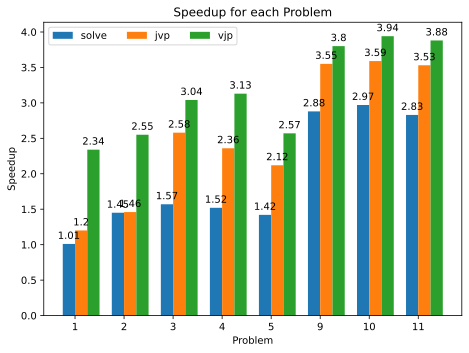

The speedup will be much larger for higher resolutions.

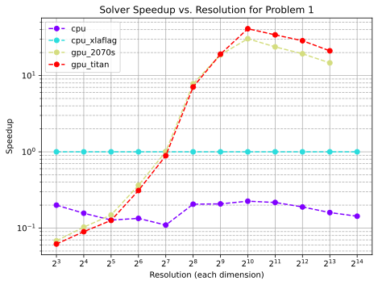

The plot shows how speedup scales with resolution for `problem 1` solver calls. In this particular configuration, the CPU version appears to be faster for resolutions below `128`. Qualitatively, the graph looks about the same for `jax.jvp`, and similar for `jax.vjp` calls. However, note that you may run into [memory issues on GPU](#memory-allocation-gpu).

<a id="execution-time-of-compiled-functions-cpu"></a>

## Execution Time of Compiled Functions (CPU)

In `jaxlib-v0.4.32` a [new version of the CPU backend](https://github.com/jax-ml/jax/blob/main/CHANGELOG.md#jaxlib-0432-september-11-2024) was implemented, which, while improving compilation times a bit, is **extremely detrimental** to runtime performance (at least on the tested platforms). Thus, when using a newer version of `jax` (`jaxlib>=0.4.32`), consider switching to the old CPU backend by setting the environment variable `XLA_FLAGS='--xla_cpu_use_thunk_runtime=false'`.

This can be done from within a `Python` script (before importing `jax` or other relevant libraries; see [xla_flags](https://jax.readthedocs.io/en/latest/xla_flags.html)) using:

```python
import os
os.environ["XLA_FLAGS"] = '--xla_cpu_use_thunk_runtime=false'
```

The following plot shows the speedup of setting this flag to `false` for a system with `jaxlib==0.4.35` and an [AMD Ryzen Threadripper 2950X](https://en.wikichip.org/wiki/amd/ryzen_threadripper/2950x) CPU for a resolution of `128`.

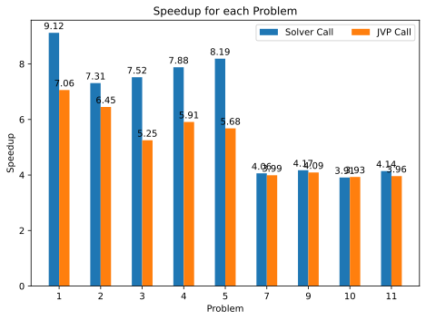

<a id="memory-allocation-gpu"></a>

## Memory Allocation (GPU)

For larger resolutions (e.g. `>4096`) you might encounter some form of "out of memory" (OOM) error, which may be avoidable by choosing a different memory allocation strategy. The page [gpu memory allocation](https://jax.readthedocs.io/en/latest/gpu_memory_allocation.html) shows three environment variables that can be used to control the memory allocation behavior. While setting `XLA_PYTHON_CLIENT_ALLOCATOR=platform` does reduce performance, it does *not* seem to be as drastic as described on the page for this use case. Note that even the [NVIDIA Titan RTX](https://www.techpowerup.com/gpu-specs/titan-rtx.c3311) with its `24 GB` of memory was unable to solve any of the problems for a resolution of `16384`. For more details, look at the corresponding memory consumption plots below.

## Memory Consumption

A lot of memory is consumed with larger resolutions.

Since peak memory consumption strongly depends on the exact behavior of the garbage collector, actual measurements might not yield a *tight* upper bound on the memory requirement. Reasonable lower bounds were obtained by using [AOT compilation](https://jax.readthedocs.io/en/latest/aot.html) and [memory analysis](https://jax.readthedocs.io/en/latest/jax.stages.html#jax.stages.Compiled.memory_analysis) to obtain estimated memory requirements. Note that they are still very platform dependent. The following plots illustrate these results for `problem 1`.

Result for CPU:

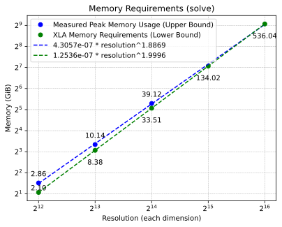

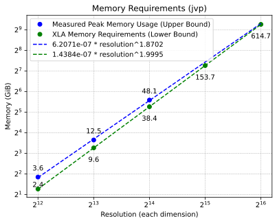

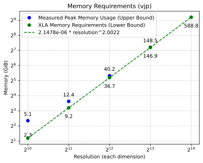

Result for GPU (2070S):

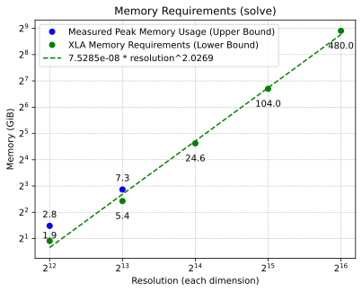

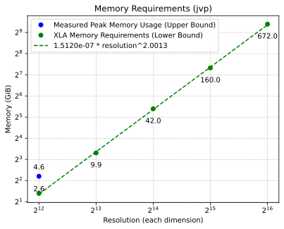

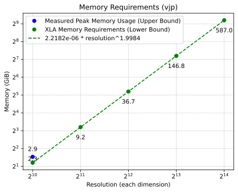

## Compilation Time

The [persistent compilation cache](https://jax.readthedocs.io/en/latest/persistent_compilation_cache.html) can be used to cache compiled functions on the local disk. This reduces (but does not avoid) recompilation times across multiple script runs.

```python
import jax
jax.config.update("jax_compilation_cache_dir", "/tmp/jax_cache")
jax.config.update("jax_persistent_cache_min_entry_size_bytes", -1)
jax.config.update("jax_persistent_cache_min_compile_time_secs", 0)
jax.config.update("jax_persistent_cache_enable_xla_caches", "xla_gpu_per_fusion_autotune_cache_dir")
```

Note that, unless the solver performs a very large number of iterations or the resolution is very high, the compilation time is extremely high compared to the execution time of a *repeated* run since the multigrid setup introduces many instructions (different array shapes on each level).

The following plots illustrate the ratio between warm-up run and repeated runs:

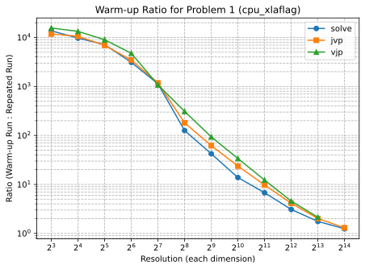

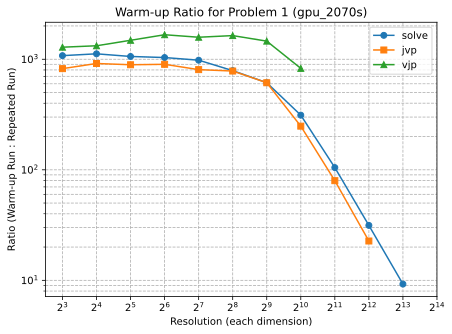
